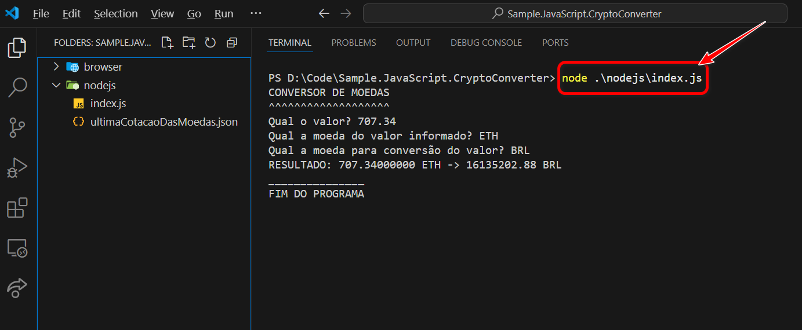
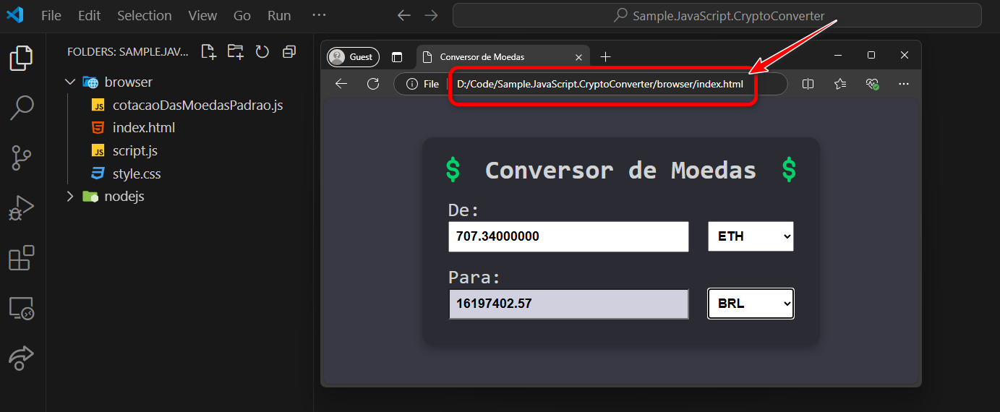

# Conversor de Moedas

Este projeto é um aplicativo simples de conversão de moedas, desenvolvido em **JavaScript**, com duas implementações: uma para execução no **Node.js** e outra no **navegador**.

Acesse a versão web para navegador em: https://crypto-conv.vercel.app/

## Funcionalidades

- Conversão de valores entre diferentes moedas.
- Uso de API pública para obter cotações atualizadas.
- Implementação fácil de entender para iniciantes.

## Estrutura do Projeto

- **nodejs**: Versão executável no Node.js.
  - `index.js`: Código principal do conversor no terminal.
  - `ultimaCotacaoDasMoedas.json`: Arquivo que salva a última cotação obtida.

---

- **browser**: Versão executada no navegador.
  - `index.html`: Interface HTML do conversor.
  - `style.css`: Estilos para a interface.
  - `script.js`: Código JavaScript para a lógica de conversão.
  - `cotacaoDasMoedasPadrao.js`: Dados padrão de moedas para fallback.
  - Publicado em: https://crypto-conv.vercel.app/

## Como Executar

### Node.js

1. Certifique-se de ter o **Node.js** instalado.
2. Navegue até o diretório `nodejs`.
3. Execute o comando: `node index.js`
4. Insira os valores e moedas solicitados.

### Navegador

1. Abra o arquivo `index.html` no navegador.
2. Preencha os campos com os valores e moedas desejados.
3. O resultado será exibido automaticamente.

## API Utilizada

- [Binance Ticker API](https://api2.binance.com/api/v3/ticker/24hr): Para obter cotações atualizadas.

## Pré-requisitos

- Node.js (para a versão no terminal).
- Navegador moderno com suporte a **fetch API**.

## Observação

- Caso a API não esteja acessível, o programa no navegador utilizará dados padrão.
- No Node.js, se a API falhar, será usada a última cotação salva localmente.
